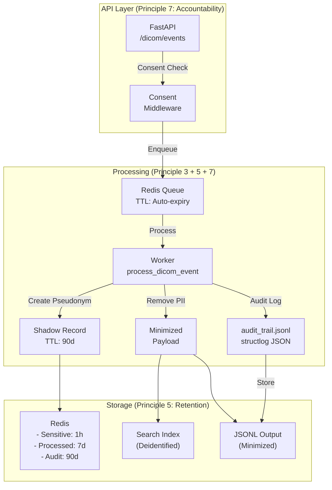

# Healthcare Data Pipeline

## Overview
This repository demonstrates a **GDPR-compliant** radiology-focused healthcare ingestion pipeline for DICOM metadata. It combines FastAPI, asynchronous queue processing, and privacy-preserving data handling to show how large medical image payloads can be processed safely without blocking the web API.

**Key principles implemented:**
- **Principle 3: Data Minimization** - Automatic removal of unnecessary PII from DICOM metadata
- **Principle 5: Storage Limitation** - Redis TTL-based automatic data retention and deletion policies  
- **Principle 7: Accountability** - Structured JSON audit logging via `structlog` for regulatory compliance

- Schema-first validation using Pydantic (Designed with Data Minimisation and Lawfulness under UK GDPR in mind)
- Future support for FHIR Patient/Observation resource mapping

---

## What's implemented

### GDPR Compliance Features

#### Principle 3: Data Minimization (`worker/data_minimization.py`)
- **Automatic PII removal**: `pydicom`-based extraction and removal of unnecessary patient identifiers
- **Pseudonymization**: Irreversible SHA-256 hashing for audit linkage without re-identification risk
- **Example**: Removes `PatientName`, `PatientBirthDate`, `InstitutionName` while retaining medically necessary fields like `StudyUID`, `Modality`

```python
from worker.data_minimization import remove_pii_from_dicom_metadata, PatientPseudonymizer

# Remove unnecessary PII
minimized = remove_pii_from_dicom_metadata(dicom_dict)

# Create pseudonym for audit trail
pseudonymizer = PatientPseudonymizer()
pseudonym_id = pseudonymizer.pseudonymize_patient_id("P12345")
```

#### Principle 5: Storage Limitation (`worker/data_minimization.py`)
- **TTL-based retention**: Redis `SETEX` with configurable time-to-live
  - Sensitive data: **1 hour** (processing window)
  - Shadow audit records: **90 days** (regulatory retention)
  - Processed events: **7 days** (analytics window)

```python
from worker.data_minimization import store_sensitive_data_with_ttl, SENSITIVE_DATA_TTL

# Auto-expires sensitive data after 1 hour
store_sensitive_data_with_ttl(
    key=f"sensitive:patient:{event_id}",
    value={"patient_id": "P123", "patient_name": "John Doe"},
    ttl_seconds=3600,  # 1 hour
    purpose="processing"
)
```

#### Principle 7: Accountability (`worker/logger.py`)
- **Structured JSON audit trails** via `structlog`  
- **Audit log JSONL format** for easy ingestion into SIEM/compliance tools
- **Event types logged**:
  - `data_ingestion`: When data enters the pipeline
  - `data_deidentification`: When PII is removed (Principle 3)
  - `data_retention_policy`: When TTL is configured (Principle 5)
  - `consent_management`: When consent is recorded (GDPR Article 7)
  - `data_access`: When data is accessed/processed
  - `data_deletion`: When data is automatically deleted
  - `security_breach`: For incident reporting (GDPR Article 33)

```python
from worker.logger import audit_logger

# Structured audit logging
audit_logger.log_data_deidentification(
    event_id="evt-123",
    patient_id="P123",
    pseudonym_id="PS_a1b2c3d4",
    fields_removed=["patient_name", "patient_birth_date"],
    purpose="gdpr_principle_3_minimization"
)

# Audit trail written to /data/logs/audit_trail.jsonl
# Example log entry:
# {
#   "event_type": "data_deidentification",
#   "event_id": "evt-123",
#   "fields_removed": ["patient_name", "patient_birth_date"],
#   "field_count": 2,
#   "purpose": "gdpr_principle_3_minimization",
#   "principle": "minimization_principle_3",
#   "timestamp": "2024-01-15T10:30:45.123Z"
# }
```

---

## What changed
- Added GDPR Principle 3 (Data Minimization): Automatic PII removal using `pydicom`
- Added GDPR Principle 5 (Storage Limitation): Redis TTL management for all data categories
- Added GDPR Principle 7 (Accountability): `structlog`-based JSON audit logging
- Implemented `PatientPseudonymizer` for irreversible patient linkage in audit trails
- Implemented shadow record storage for re-identification during data subject access requests
- Extended `/dicom/events` endpoint with consent logging and audit trail integration
- Added FastAPI endpoint for DICOM metadata ingestion at /dicom/events
- Implemented automatic de-identification of patient name and birth date before storage
- Added a lightweight queue layer for DICOM events with Redis and in-memory fallback
- Added a searchable index endpoint at /dicom/search for clinical metadata retrieval
- Added a Docker multi-stage image for consistent deployment
- Added data-minimised clinical payloads and FHIR-style mapping layer

---

## Architecture



---

## Running the pipeline

### 1. Install dependencies
```bash
pip install -r requirements.txt
```

### 2. Set environment variables
```bash
export PROJECT_ID=healthcare-pipeline-yk-01
export REDIS_HOST=localhost
export REDIS_PORT=6379
export LOG_LEVEL=INFO
export PATIENT_HASH_SALT=your-production-salt-here
export SENSITIVE_DATA_TTL=3600          # 1 hour
export PROCESSED_EVENT_TTL=604800       # 7 days
export AUDIT_LOG_TTL=7776000            # 90 days
```

### 3. Start services locally

**Terminal 1: Redis**
```bash
redis-server
```

**Terminal 2: Celery Worker**
```bash
celery -A worker.celery_app.celery_app worker --loglevel=info
```

**Terminal 3: FastAPI**
```bash
uvicorn api.main:app --reload --host 0.0.0.0 --port 8000
```

**Terminal 4: Background Worker (optional)**
```bash
python worker/worker.py
```

### 4. Test the API

```bash
curl -X POST http://localhost:8000/dicom/events \
  -H "Content-Type: application/json" \
  -d '{
    "patient_name": "John Doe",
    "patient_birth_date": "1980-01-01",
    "study_uid": "1.2.826.0.1.3680043.8.498.123456",
    "modality": "CT",
    "kVp": 120,
    "mA": 250,
    "consent_logged": true,
    "source": "PACS",
    "purpose": "diagnostic_support"
  }'
```

### 5. View audit logs

```bash
tail -f data/logs/audit_trail.jsonl | jq .
```

### Docker

```bash
docker build -t healthcare-data-pipeline .
docker run -p 8000:8000 \
  -e REDIS_HOST=host.docker.internal \
  -e PROJECT_ID=healthcare-pipeline-yk-01 \
  healthcare-data-pipeline
```

### Tests

```bash
python -m pytest
```
```

### Push changes

```bash
git add .
git commit -m "<message>"
git push origin main
```

---

## API endpoints
- POST /events for basic clinical metadata ingestion
- POST /dicom/events for anonymized DICOM metadata ingestion
- GET /dicom/search?study_uid=... for indexed result lookup