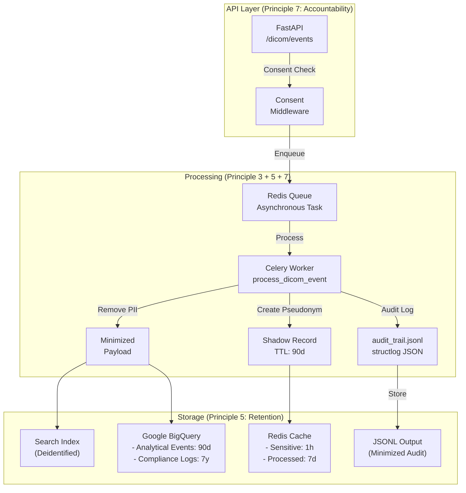

# Healthcare Data Ingestion Pipeline (UK GDPR Compliant by Design)

An enterprise-grade, asynchronous data pipeline built with **FastAPI**, **Celery**, **Redis**, and **Google BigQuery**, specifically architected for processing medical imaging metadata (DICOM) under strict regulatory compliance frameworks, including **UK GDPR** and **HIPAA**.

## Core Architecture Overview

The system captures clinical diagnostic events, segregates sensitive clinical metadata from patient-identifiable identifiers immediately upon arrival, and utilizes an asynchronous task worker network to ensure low latency and total fault tolerance.



---

## Reliability Engineering

Pub/Sub delivers **at-least-once**. Duplicates and redeliveries are documented
behaviour, not edge cases, so the consumer is built around them rather than
around the happy path.

### Delivery semantics

Every failure answers one question — *should this message be redelivered?* —
and the handler dispatches on the answer, never on the concrete exception type
(`common/errors.py`). Getting it wrong is expensive in both directions:
retrying a poison message pins a subscriber forever, while acking a transient
failure destroys a clinical event.

| Situation | Action | Rationale |
|---|---|---|
| Body is not UTF-8 / not a JSON object | **ack** | Can never parse → quarantine |
| Payload fails schema validation | **ack** | Can never validate → quarantine |
| Consent absent / purpose not approved | **ack** | Must not be processed at all |
| Already completed | **ack** | Work is done; drop silently |
| Another worker holds the lease | **nack** | Don't race it |
| Dedup backend down (`fail_mode=closed`) | **nack** | Never process unprotected |
| Transient processing failure | **nack** | Retry within the delivery budget |
| Delivery budget exhausted | **ack** | Break the poison loop → quarantine |
| Unclassified exception | **nack** | Bias to keeping data; budget bounds it |

The whole matrix is unit-tested against an in-process message double
(`tests/test_message_handler.py`), including the invariant that every delivery
is settled **exactly once** — an unsettled message silently holds a
flow-control slot until its ack deadline expires.

### Idempotency (`common/idempotency.py`)

A three-state claim protocol whose decision point is a single atomic
`SET key value NX EX ttl`:

```
NEW  ──►  in-progress:<fencing-token>  ──►  done
```

* **ACQUIRED** — this worker owns the event.
* **IN_FLIGHT** — another worker holds an unexpired lease → nack.
* **DUPLICATE** — already completed → ack and drop.

The lease carries a **fencing token**, so a worker that stalled past its lease
cannot later delete or complete a claim a different worker has taken over.
The commit happens *before* the ack: a crash in between yields a duplicate
that dedup catches, whereas the reverse order would ack work the store has no
record of.

`IDEMPOTENCY_FAIL_MODE` makes the CAP trade-off explicit. The default,
`closed`, refuses to process when Redis is unavailable — consistency over
availability, because the subscription will hold the work until Redis returns,
and a duplicate imaging record double-counts in every downstream aggregate and
emits a second audit entry claiming a second access to a patient's data.

### PHI-safe error handling (`common/schemas.py`, `api/errors.py`)

Pydantic's `ValidationError.errors()` includes the **rejected input value**, and
FastAPI's default 422 body is built from exactly that. For a DICOM endpoint,
a mistyped date of birth is therefore echoed into the response body, the access
log, and any error tracker in the path — a personal-data disclosure caused by a
validation bug rather than by any line of code someone wrote.

`safe_validation_errors()` returns field path, constraint type and constraint
message with values stripped, and applies a stricter rule to identifier-bearing
fields. The same scrubbing covers the quarantine sink, which stores a SHA-256
digest of the rejected body instead of the body itself.

### Failure isolation

* **No import-time I/O.** Every client is lazily constructed with explicit
  socket timeouts. Previously two modules pinged Redis at import with no
  timeout, blocking module import for ~50 s each on a host without Redis.
* **Circuit breaker** on Redis: after a failure the client stops dialling for
  a cooldown, so an outage costs a constant per call rather than a timeout each.
* **Fail-fast broker.** `apply_async` against an unreachable Redis measured
  **107 s** inside the HTTP handler, mostly from the result backend opening a
  synchronous pub/sub subscription. The result backend is removed (nothing
  awaits a Celery result, and it persisted clinical metadata with no consumer);
  what remains is bounded at ~2 s with an explicit fallback.
* **Startup validation.** The API refuses to boot on unsafe configuration —
  default pseudonymisation salt, PHI-persisting quarantine, or fail-open
  idempotency in production.
* **Honest status codes.** A publish failure returns `503` with `Retry-After`.
  It previously returned **HTTP 200** with `{"status": "error"}`, so a PACS
  reading the status code recorded studies as ingested that never reached the
  topic — silent clinical data loss, invisible to uptime monitoring.

---

## UK GDPR Compliance Mapping (Compliance-as-Code)

This platform explicitly treats regulatory requirements as non-functional architectural constraints. Below is the direct structural mapping between **UK GDPR Article 5 Principles** and this codebase:

### 1. Data Minimisation (Principle 3)

* **Requirement:** Personal data must be adequate, relevant, and limited to what is necessary for the purposes for which they are processed.
* **Code Implementation:**
* `worker/data_minimization.py` (`remove_pii_from_dicom_metadata`): Automatically strips high-risk patient fields (`PatientName`, `PatientBirthDate`, `InstitutionName`, `ReferringPhysicianName`) from the active processing stream.
* `worker/data_minimization.py` (`PatientPseudonymizer`): Utilizes salt-based, deterministic HMAC-SHA256 cryptographic hashes to generate irreversible pseudo-IDs (`PS_` and `PN_` prefixes) for operational mapping without persisting cleartext IDs.


### 2. Accuracy (Principle 4)

* **Requirement:** Personal data must be accurate and, where necessary, kept up to date; every reasonable step must be taken to ensure inaccurate data is erased or rectified.
* **Code Implementation:**
* `worker/worker.py` (`process_event`): Enforces clinical data validation rules (e.g., verifying realistic `slice_thickness`, discarding future-dated `study_date`, and checking formatting protocols) before generating internal clinical quality metrics.


### 3. Storage Limitation (Principle 5)

* **Requirement:** Data must be kept in a form which permits identification of data subjects for no longer than is necessary.
* **Code Implementation:**
* `worker/data_minimization.py` (`store_sensitive_data_with_ttl`): Leverages Redis `SETEX` commands to hardcode an ephemeral **1-hour Time-To-Live (TTL)** (`ex=3600`) on raw input states during the processing lifecycle.
* `worker/bigquery_integration.py` (`BigQueryDataWarehouse`): Configures automated Google BigQuery Table Partitioning (`PARTITION BY DATE(created_at)`) bound to a rigorous **90-day expiration policy** (`partition_expiration_days=90`) for core transactional logs, automatically wiping historical clinical data.


### 4. Integrity and Confidentiality (Principle 6)

* **Requirement:** Processed in a manner that ensures appropriate security of the personal data, including protection against unauthorised or unlawful processing.
* **Code Implementation:**
* `worker/bigquery_integration.py` (`_ensure_dataset_and_tables_exist`): Enforces localized regional boundaries by locking the data warehouse location specifically to the **"EU" region** to isolate residency data outside foreign multi-region grids.


### 5. Accountability (Principle 7)

* **Requirement:** The controller shall be responsible for, and be able to demonstrate compliance with, the core principles.
* **Code Implementation:**
* `worker/logger.py` (`StructuredLogger`): Fully configures `structlog` serialization utilizing `JSONRenderer` to route immutable, machine-readable audit streams to `stdout` for SIEM ingestors. It tracks data state transitions across lifecycle hooks (`log_data_ingestion`, `log_data_deidentification`, `log_consent_record`, and `log_breach_notification`).


---

## Tech Stack & Core Libraries

* **Framework:** FastAPI (Python 3.12)
* **Task Worker:** Celery 5.4+ distributed framework
* **Caching & In-Memory Storage:** Redis 7.0+
* **Data Warehouse Engine:** Google Cloud BigQuery Client Wrapper
* **Clinical Processing:** pydicom (Healthcare Imaging Metadata Extractor)
* **Structured Auditing:** structlog (JSON Structured Audit trail provider)

---

## Local Environment Quickstart

### 1. Installation & Environment Configuration

Clone the repository and install all required clinical and architectural dependencies inside a virtual environment:

```bash
pip install -r requirements.txt
cp .env.example .env

```

Ensure your local `.env` contains the required encryption seeds and infrastructure keys:

```ini
PROJECT_ID=healthcare-pipeline-yk-01
REDIS_URL=redis://localhost:6379/0
SENSITIVE_DATA_TTL=3600
BQ_RETENTION_EVENTS_DAYS=90
APP_SECRET_SALT=your_secure_cryptographic_salt_here

```

### 2. Multi-Terminal Cluster Setup

**Terminal 1: Start Redis Instance**

```bash
redis-server

```

**Terminal 2: Start Asynchronous Celery Worker Network**

```bash
celery -A worker.celery_app.celery_app worker --loglevel=info

```

**Terminal 3: Launch FastAPI Ingestion Gateway**

```bash
uvicorn api.main:app --reload --host 0.0.0.0 --port 8000

```

---

## Verification & Testing Strategy

190 tests covering delivery semantics, duplicate suppression, schema
enforcement and PHI containment. The suite runs **fully offline in ~5 seconds**
— Redis and Pub/Sub are replaced by in-process doubles in `tests/conftest.py`,
so CI needs no service containers and no GCP credentials.

```bash
python -m pytest -q
```

Two design choices make the reliability behaviour testable at all:

* **A controllable clock.** Lease expiry and circuit-breaker cooldowns are
  time-dependent; injecting the clock tests the real behaviour in microseconds
  rather than approximating it with `sleep`.
* **A Redis double that fails on demand.** `FakeRedis.set_failing()` simulates
  a mid-test outage, which is how the fail-closed idempotency path and the
  circuit breaker are covered. These are precisely the paths that cannot be
  triggered reliably against a live broker.

| Module | Focus |
|---|---|
| `test_message_handler.py` | ack/nack matrix, poison messages, retry budget, exactly-once settlement |
| `test_idempotency.py` | concurrent claims, lease expiry, fencing tokens, fail-open vs fail-closed |
| `test_schema_validation.py` | clinical plausibility rules, PHI-free error rendering |
| `test_api_error_handling.py` | status codes, no PHI in 4xx/5xx bodies, health probes |
| `test_redis_resilience.py` | lazy connect, timeouts, circuit breaker, recovery without restart |
| `test_pubsub_publisher.py` | lazy client, bounded publish, typed failures, attribute hygiene |

### Ingestion Validation Scenario

To simulate a standard PACS ingestion payload with clinical data and explicit consent flags, run the following transaction:

```bash
curl -X POST http://localhost:8000/dicom/events \
  -H "Content-Type: application/json" \
  -d '{
    "patient_name": "John Doe",
    "patient_birth_date": "1980-01-01",
    "study_uid": "1.2.826.0.1.3680043.8.498.123456",
    "modality": "CT",
    "kVp": 120,
    "mA": 250,
    "consent_logged": true,
    "source": "PACS",
    "purpose": "diagnostic_support"
  }'

```

### Inspecting Delivery Semantics

The reliability behaviour — duplicate suppression, retry budgets, quarantine —
is invisible in a normal request trace. `scripts/inspect_delivery.py` feeds
messages straight into the receive-path handler and prints each decision, with
no broker required:

```bash
python scripts/inspect_delivery.py
```

```
Redis: UP
scenario                    outcome                   settle reason
------------------------------------------------------------------------
valid event                 processed                 ACK
SAME event redelivered      duplicate                 ACK
malformed JSON              quarantined_invalid       ACK    message_decode_failed
unsupported modality        quarantined_invalid       ACK    schema_validation_failed
unapproved purpose          quarantined_invalid       ACK    purpose_limitation_violated
downstream down (attempt 1) retry                     NACK   downstream_unavailable
downstream down (attempt 5) quarantined_exhausted     ACK    retry_budget_exhausted
```

Run it **without** Redis to watch the fail-closed policy change the outcome of
the same messages: every valid event is nacked with
`idempotency_backend_unavailable` rather than processed without duplicate
protection.

```bash
docker stop hdp-redis && python scripts/inspect_delivery.py   # fail-closed
docker run -d --rm --name hdp-redis -p 6379:6379 redis:7-alpine
python scripts/inspect_delivery.py                            # normal
```

### Inspecting Output Streams

```bash
# SIEM-ready structured audit trail (Principle 7)
tail -f logs/audit_trail.jsonl

# Dead-letter sink: digests and field errors, never the payload
cat data/quarantine.jsonl | python -m json.tool

# Idempotency state: lease vs completed marker, with remaining TTL
docker exec hdp-redis redis-cli --scan --pattern 'idemp:*'
docker exec hdp-redis redis-cli GET  'idemp:v1:dicom:<event-id>'
docker exec hdp-redis redis-cli TTL  'idemp:v1:dicom:<event-id>'
```

### Verifying PHI Containment

The rejection paths are where patient data leaks by default. Each of these
should return a useful error with **no** value from the submitted payload:

```bash
# 422 - invalid date of birth. FastAPI's stock handler would echo it back.
curl -s -X POST http://localhost:8000/dicom/events -H 'Content-Type: application/json' \
  -d '{"patient_name":"John Doe","patient_birth_date":"1980-99-99",
       "study_uid":"1.2.826.0.1.3680043.8.498.123456","modality":"CT","consent_logged":true}'

# 403 - purpose limitation | 400 - malformed body | 503 - publish unavailable
```

Expected 422 body — the field and its constraint, and nothing else:

```json
{"error":"validation_failed",
 "errors":[{"field":"patient_birth_date","type":"date_from_datetime_parsing",
            "message":"invalid value for restricted field (constraint: date_from_datetime_parsing)"}],
 "correlation_id":"e7ad4dca54594d6b98b5698f50bafad0"}
```

The `correlation_id` matches the `X-Request-ID` response header and appears in
the audit trail, so an operator can reconstruct the full context from the logs
without any of it being in the response.

---

## Production Readiness Roadmap

To transition this system into a multi-region live environment, the following infrastructure enhancements are scheduled:

1. **Cloud KMS Integration:** Move `PATIENT_HASH_SALT` into Google Cloud KMS / Secret Manager. The startup validator already refuses to run on the default salt in production; this closes the loop by removing the secret from the environment entirely.
2. **On-Demand GDPR Art. 17 Endpoints:** Distributed purge hooks to wipe matching `pseudonym_id` blocks on erasure request, using the shadow records in `data_minimization.py` for linkage.
3. **Broker-side Dead Letter Topic:** The quarantine sink is currently a local JSONL file. Attaching a Pub/Sub dead-letter topic with `maxDeliveryAttempts` matching `PUBSUB_MAX_DELIVERY_ATTEMPTS` moves it to durable, replayable storage.
4. **Metrics export:** `PubSubMessageHandler` already emits a structured `HandlerResult` per delivery through an `on_result` hook; wiring it to Prometheus gives duplicate rate, quarantine rate and retry depth without further instrumentation.