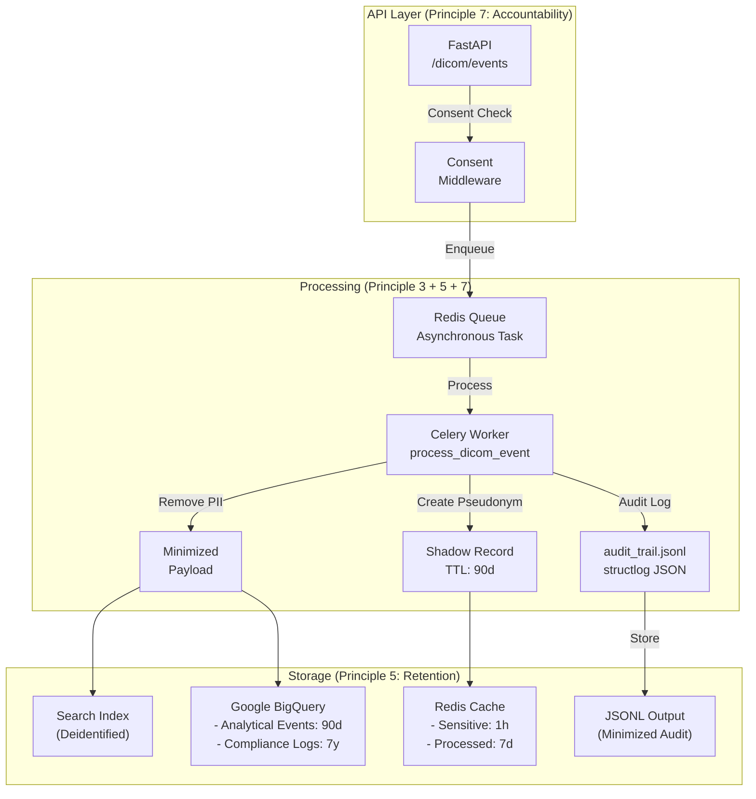

# Healthcare Data Ingestion Pipeline (UK GDPR Compliant by Design)

An enterprise-grade, asynchronous data pipeline built with **FastAPI**, **Celery**, **Redis**, and **Google BigQuery**, specifically architected for processing medical imaging metadata (DICOM) under strict regulatory compliance frameworks, including **UK GDPR** and **HIPAA**.

## Core Architecture Overview

The system captures clinical diagnostic events, segregates sensitive clinical metadata from patient-identifiable identifiers immediately upon arrival, and utilizes an asynchronous task worker network to ensure low latency and total fault tolerance.



---

## UK GDPR Compliance Mapping (Compliance-as-Code)

This platform explicitly treats regulatory requirements as non-functional architectural constraints. Below is the direct structural mapping between **UK GDPR Article 5 Principles** and this codebase:

### 1. Data Minimisation (Principle 3)

* **Requirement:** Personal data must be adequate, relevant, and limited to what is necessary for the purposes for which they are processed.
* **Code Implementation:**
* `worker/data_minimization.py` (`remove_pii_from_dicom_metadata`): Automatically strips high-risk patient fields (`PatientName`, `PatientBirthDate`, `InstitutionName`, `ReferringPhysicianName`) from the active processing stream.
* `worker/data_minimization.py` (`PatientPseudonymizer`): Utilizes salt-based, deterministic HMAC-SHA256 cryptographic hashes to generate irreversible pseudo-IDs (`PS_` and `PN_` prefixes) for operational mapping without persisting cleartext IDs.


### 2. Accuracy (Principle 4)

* **Requirement:** Personal data must be accurate and, where necessary, kept up to date; every reasonable step must be taken to ensure inaccurate data is erased or rectified.
* **Code Implementation:**
* `worker/worker.py` (`process_event`): Enforces clinical data validation rules (e.g., verifying realistic `slice_thickness`, discarding future-dated `study_date`, and checking formatting protocols) before generating internal clinical quality metrics.


### 3. Storage Limitation (Principle 5)

* **Requirement:** Data must be kept in a form which permits identification of data subjects for no longer than is necessary.
* **Code Implementation:**
* `worker/data_minimization.py` (`store_sensitive_data_with_ttl`): Leverages Redis `SETEX` commands to hardcode an ephemeral **1-hour Time-To-Live (TTL)** (`ex=3600`) on raw input states during the processing lifecycle.
* `worker/bigquery_integration.py` (`BigQueryDataWarehouse`): Configures automated Google BigQuery Table Partitioning (`PARTITION BY DATE(created_at)`) bound to a rigorous **90-day expiration policy** (`partition_expiration_days=90`) for core transactional logs, automatically wiping historical clinical data.


### 4. Integrity and Confidentiality (Principle 6)

* **Requirement:** Processed in a manner that ensures appropriate security of the personal data, including protection against unauthorised or unlawful processing.
* **Code Implementation:**
* `worker/bigquery_integration.py` (`_ensure_dataset_and_tables_exist`): Enforces localized regional boundaries by locking the data warehouse location specifically to the **"EU" region** to isolate residency data outside foreign multi-region grids.


### 5. Accountability (Principle 7)

* **Requirement:** The controller shall be responsible for, and be able to demonstrate compliance with, the core principles.
* **Code Implementation:**
* `worker/logger.py` (`StructuredLogger`): Fully configures `structlog` serialization utilizing `JSONRenderer` to route immutable, machine-readable audit streams to `stdout` for SIEM ingestors. It tracks data state transitions across lifecycle hooks (`log_data_ingestion`, `log_data_deidentification`, `log_consent_record`, and `log_breach_notification`).


---

## Tech Stack & Core Libraries

* **Framework:** FastAPI (Python 3.12)
* **Task Worker:** Celery 5.4+ distributed framework
* **Caching & In-Memory Storage:** Redis 7.0+
* **Data Warehouse Engine:** Google Cloud BigQuery Client Wrapper
* **Clinical Processing:** pydicom (Healthcare Imaging Metadata Extractor)
* **Structured Auditing:** structlog (JSON Structured Audit trail provider)

---

## Local Environment Quickstart

### 1. Installation & Environment Configuration

Clone the repository and install all required clinical and architectural dependencies inside a virtual environment:

```bash
pip install -r requirements.txt
cp .env.example .env

```

Ensure your local `.env` contains the required encryption seeds and infrastructure keys:

```ini
PROJECT_ID=healthcare-pipeline-yk-01
REDIS_URL=redis://localhost:6379/0
SENSITIVE_DATA_TTL=3600
BQ_RETENTION_EVENTS_DAYS=90
APP_SECRET_SALT=your_secure_cryptographic_salt_here

```

### 2. Multi-Terminal Cluster Setup

**Terminal 1: Start Redis Instance**

```bash
redis-server

```

**Terminal 2: Start Asynchronous Celery Worker Network**

```bash
celery -A worker.celery_app.celery_app worker --loglevel=info

```

**Terminal 3: Launch FastAPI Ingestion Gateway**

```bash
uvicorn api.main:app --reload --host 0.0.0.0 --port 8000

```

---

## Verification & Testing Strategy

The repository maintains strict enforcement of compliance via comprehensive integration and unit tests covering regulatory edge cases:

```bash
# Execute full suite including validation tests
python -m pytest -v

```

### Ingestion Validation Scenario

To simulate a standard PACS ingestion payload with clinical data and explicit consent flags, run the following transaction:

```bash
curl -X POST http://localhost:8000/dicom/events \
  -H "Content-Type: application/json" \
  -d '{
    "patient_name": "John Doe",
    "patient_birth_date": "1980-01-01",
    "study_uid": "1.2.826.0.1.3680043.8.498.123456",
    "modality": "CT",
    "kVp": 120,
    "mA": 250,
    "consent_logged": true,
    "source": "PACS",
    "purpose": "diagnostic_support"
  }'

```

### Validating SIEM-ready Audit Output

Inspect the local output stream to verify structural JSON logging output:

```bash
cat data/logs/audit_trail.jsonl

```

---

## Production Readiness Roadmap

To transition this system into a multi-region live environment, the following infrastructure enhancements are scheduled:

1. **Cloud KMS Integration:** Moving the local `APP_SECRET_SALT` to dynamic hardware security modules (HSM) using Google Cloud Key Management Service.
2. **On-Demand GDPR Art. 17 Endpoints:** Introducing distributed worker purging hooks to wipe matching cryptographic `pseudonym_id` blocks upon immediate consumer request.
3. **Task-Level Dead Letter Queues (DLQ):** Enforcing explicit isolation routing on tasks encountering persistent downstream database exceptions.